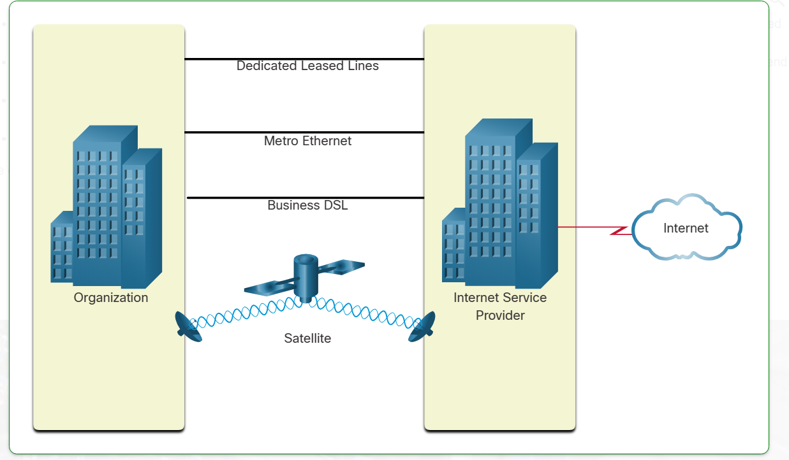

## __Thành phần mạng__
- ### Hosts, servers: 
    - Server là một máy cung cấp tài nguyên
    - Host là bất thì devices nào có ip và kết nối internet
    - Tất cả các máy tính được kết nối với mạng và tham gia trực tiếp vào giao tiếp mạng đều được phân loại là máy chủ (host).
    - Server cũng được gọi là máy cuối (end devices)
    - Mỗi máy chủ(server) cho phép cung cấp thông tin, mỗi dịch vụ yêu cầu máy chủ riêng
        - Web server : 
        - Email server
        - File server
    -
- ### Peer-to-Peer (_ngang hàng với nhau_)
    - __K/n__ : Vừa Clients vừa là server trên cách máy tính riêng biệt
    - __Ưu điểm__ : 
        - dễ setup
        - ít phức tạp
        - chi phí thấp (_vì không cần máy chuyên dụng_)
        - có thể sử dụng các tác vụ cơ bản như truyền file, chi sẻ máy in
    - __Nhược điểm__ :
        - Không có quản trị tập trung
        - Không an toàn
        - Không có khả năng mở rộng
        - Tất cả các  thiết bị có thể hoạt động như cả máy khách và máy chủ, điều này có thể làm chậm hiệu suất của chúng

- ### End Devices (_thiết bị cuối_)
    - Là những thiết bị thường ngày có thể kết nối mạng
    - có địa chỉ ip riêng

- ### Intermediary Devices (_thiết bị trung gian_)
    - __K/n__ : 
        - Là thiết bị kết nối với các thiết bị end devices riêng lẻ với nhau
        - có thể kết nối nhiều mạng riêng lẻ với nhau tạo mạng lưới
        - Thiết bị trung gian sử dụng địa chỉ thiết bị đầu cuối đích, kết hợp với thông tin về các kết nối mạng, để xác định đường dẫn mà các thông điệp sẽ đi qua mạng
    - __Chức năng__ :
        - Tạo lại và truyền lại tín hiệu truyền thông
        - Duy trì thông tin về các đường dẫn tồn tại qua mạng và mạng nội bộ
        - Thông báo cho các thiết bị khác về lỗi và lỗi truyền thông
        - Chuyển hướng dữ liệu theo các đường dẫn thay thế khi có lỗi liên kết
        - Phân loại và chuyển hướng tin nhắn theo thứ tự ưu tiên
        - Cho phép hoặc từ chối luồng dữ liệu, dựa trên cài đặt bảo mật
    - __Lưu ý__: Không hiển thị là hub Ethernet cũ. Hub Ethernet cũng được gọi là bộ lặp đa cổng. Bộ lặp tái tạo và truyền lại tín hiệu truyền thông. Lưu ý rằng tất cả các thiết bị trung gian đều thực hiện chức năng của bộ lặp.

- ### Network Media
    - __K/n__ : như một cái day truyền dữ liệu giữa các thiết bị
    - __Các loại Loại__ : 
        - _Dây kim loại_: dữ liệu được mã hóa thành xung điện
        - _sợ thủy tinh_ : mã hóa thành xung ánh sáng
        - _truyền không dây_ : mã hóa thành tầng số sóng điện từ 
    - __Tiêu chí chọn dây mạng__:
        - Khoảng cách tối đa mà phương tiện có thể truyền tín hiệu thành công là bao nhiêu?
        - Môi trường mà phương tiện sẽ được lắp đặt là gì?
        - Lượng dữ liệu là bao nhiêu và phải truyền ở tốc độ nào?
        - Chi phí cho phương tiện và lắp đặt là bao nhiêu?

## __Topology Diagrams__ (_sơ đồ cấu trúc_)
- ### Các cổng: 
    - __Network Interface Card (NIC)__ : NIC kết nối vật lý thiết bị đầu cuối với mạng.
    - __Physical Port__ (cổng vật lí): Đầu nối hoặc ổ cắm trên thiết bị mạng nơi phương tiện kết nối với thiết bị đầu cuối hoặc thiết bị mạng khác.
    - __Interface__ (giao diện) : ổng chuyên ngành trên thiết bị mạng kết nối với từng mạng riêng lẻ. Vì bộ định tuyến kết nối mạng nên các cổng trên bộ định tuyến được gọi là giao diện mạng (_network interfaces_)
    - ___Lưu ý___: Các thuật ngữ cổng và giao diện thường được sử dụng thay thế cho nhau.
- ### Sơ đồ cấu trúc
    - __Physical Topology Diagrams__ (_sơ đồ cấu trúc vật lý_) : 
        - Sơ đồ cấu trúc vật lý minh họa vị trí vật lý của các thiết bị trung gian và lắp đặt cáp, như thể hiện trong hình
        - Bạn có thể thấy rằng các phòng đặt các thiết bị này được dán nhãn trong cấu trúc vật lý này.
    - __Logical Topology Diagrams__ (_sơ đồ cấu trúc logic_) : 
        - Sơ đồ cấu trúc logic minh họa các thiết bị, cổng và sơ đồ địa chỉ của mạng, như thể hiện trong hình
        - Bạn có thể thấy thiết bị đầu cuối nào được kết nối với thiết bị trung gian nào và phương tiện nào đang được sử dụng.

## __Common types of Networks__ (_các loại mạng phổ biến_)
- ### LAN và WAN
    

    |                    | LAN                                                                                                                                                       | WAN                                                                                                                   |
    |--------------------|-----------------------------------------------------------------------------------------------------------------------------------------------------------|-----------------------------------------------------------------------------------------------------------------------|
    | Phạm vi hoạt động  | LAN kết nối các thiết bị đầu cuối trong một khu vực hạn chế như nhà riêng, trường học, tòa nhà văn phòng hoặc khuôn viên trường.                          | WAN kết nối các LAN trên các khu vực địa lý rộng lớn như giữa các thành phố, tiểu bang, tỉnh, quốc gia hoặc châu lục. |
    | Tổ thức quản lí    | LAN thường do một tổ chức hoặc cá nhân quản lý. Kiểm soát hành chính được thực thi ở cấp độ mạng và quản lý các chính sách bảo mật và kiểm soát truy cập. | WAN thường được quản lý bởi nhiều nhà cung cấp dịch vụ.                                                               |
    | Hiệu năng          | LAN cung cấp băng thông tốc độ cao cho các thiết bị đầu cuối nội bộ và các thiết bị trung gian, như thể hiện trong hình                                   | WAN thường cung cấp các liên kết tốc độ chậm hơn giữa các LAN.                                                        |

- ### Internet
    - __K/n__: Internet là một tập hợp các mạng lưới được kết nối trên toàn thế giới (internetworks, hay gọi tắt là internet).
    - __Thông tin thêm__: Internet không thuộc sở hữu của cá nhân hay tổ chức nào. Việc duy trì và đảm bảo truyền thông hiệu quả trên hạ tầng đa dạng này cần có công nghệ, tiêu chuẩn chung và sự hợp tác giữa các cơ quan quản lý mạng. Một số tổ chức chịu trách nhiệm duy trì cấu trúc và chuẩn hóa internet gồm IETF, ICANN, IAB và nhiều tổ chức khác.
- ### Intranets and Extranets
    - có hai thuật ngữ khác tương tự thuật ngữ _internet_ là _intranet_ và _extranet_

    - __Intranet__: Một mạng nội bộ của tổ chức, chỉ cho phép các thành viên, nhân viên hoặc những người có quyền truy cập sử dụng. Nó thường được sử dụng để chia sẻ thông tin, tài nguyên trong __nội bộ tổ chức__.

    - __Extranet__: Một mạng mở rộng của intranet, cho phép các __đối tác bên ngoài__ (như nhà cung cấp, khách hàng, hoặc đối tác kinh doanh) truy cập vào một phần thông tin của tổ chức __một cách an toàn__.

    - tóm lại _intranet_ dành cho nội bộ, còn _extranet_ cho phép một số người bên ngoài truy cập có kiểm soát

## __Internet Connections__
- ### Kết nối Internet tại nhà và văn phòng nhỏ
    
    - Cáp (Cable) & DSL: Kết nối internet tốc độ cao, luôn hoạt động; cáp dùng chung với truyền hình, DSL chạy qua điện thoại (ADSL tải xuống nhanh hơn tải lên).
    - Di động (Cellular): Truy cập qua mạng di động, phụ thuộc vào tín hiệu và hạ tầng trạm phát.
    - Vệ tinh (Satellite): Phù hợp cho khu vực không có kết nối khác, cần đường truyền không bị cản trở.
    - Quay số (Dial-up): Rẻ nhưng chậm, phù hợp cho truy cập cơ bản khi di chuyển.
- ### Kết nối Internet cho doanh nghiệp
    
    - Đường truyền thuê riêng (Dedicated Leased Line): Kết nối riêng trong mạng của nhà cung cấp dịch vụ, dùng để liên kết các văn phòng ở vị trí khác nhau cho mạng thoại hoặc dữ liệu. Tính phí theo tháng hoặc năm.

    - Metro Ethernet: Còn gọi là Ethernet WAN, mở rộng công nghệ mạng LAN sang mạng WAN, cung cấp kết nối tốc độ cao cho doanh nghiệp.

    - DSL doanh nghiệp (Business DSL): Có nhiều dạng, phổ biến là SDSL (Symmetric DSL), cung cấp tốc độ tải lên và tải xuống ngang nhau, phù hợp cho doanh nghiệp.

    - Vệ tinh (Satellite): Giải pháp thay thế khi không có kết nối có dây.

- ### Mạng hội tụ (Converged Networks):
    - Hiện nay, các mạng dữ liệu, điện thoại và video không còn tách biệt mà được hợp nhất. 
    - Khác với mạng chuyên dụng, mạng hội tụ có thể truyền dữ liệu, thoại và video trên cùng một hạ tầng. 
    - Hệ thống này tuân theo các quy tắc, thỏa thuận và tiêu chuẩn chung, giúp tích hợp nhiều dịch vụ trên một mạng duy nhất.

## __Reliable Networks (mạng tin cậy)__
- ### Kiến trúc mạng (Network Architecture)

    - Mạng không chỉ truyền dữ liệu mà còn kết nối con người, thiết bị và thông tin trong môi trường hội tụ. Để hoạt động hiệu quả và phát triển, mạng cần có kiến trúc tiêu chuẩn.  

    - **Kiến trúc mạng**: bao gồm công nghệ hạ tầng vật lý, dịch vụ lập trình và các giao thức để truyền dữ liệu.  

    - **Bốn yếu tố quan trọng trong thiết kế mạng:**  
        1. **Khả năng chịu lỗi (Fault Tolerance):** Đảm bảo hoạt động liên tục ngay cả khi có sự cố.  
        2. **Khả năng mở rộng (Scalability):** Có thể mở rộng theo nhu cầu mà không ảnh hưởng hiệu suất.  
        3. **Chất lượng dịch vụ (Quality of Service - QoS):** Ưu tiên băng thông cho các ứng dụng quan trọng.  
        4. **Bảo mật (Security):** Bảo vệ dữ liệu và hệ thống khỏi truy cập trái phép.

- ### Khả năng chịu lỗi (Fault Tolerance)
    - Mạng có khả năng chịu lỗi sẽ giới hạn số thiết bị bị ảnh hưởng khi xảy ra sự cố
    - Mạng này hoạt động dựa trên nhiều đường truyền từ ngồn đến đích, nếu một đường truyền xảy ra sự cố thì chuyển hướng liên kết khác. Việc có nhiều đường truyền dự phòng được gọi là __tính dư thừa__(__redundancy__)
    - Một cách để đảm bảo tính dư thừa là 
        - Sử dụng mạng chuyển mạch gói (packet-switched network). 
        - Trong hệ thống này, dữ liệu được chia nhỏ thành nhiều gói tin (packets) và truyền qua mạng chia sẻ. 
        - Mỗi gói chứa thông tin địa chỉ của nguồn và đích. 
        - Các bộ định tuyến (routers) trong mạng sẽ điều hướng gói tin dựa trên tình trạng mạng hiện tại, nghĩa là các gói tin trong cùng một tin nhắn có thể đi theo các tuyến đường khác nhau nhưng vẫn đến cùng một đích.

- ### 1.6.3 Khả năng mở rộng (Scalability)
    - Mạng có khả năng mở rộng có thể mở rộng nhanh chóng để hỗ trợ người dùng và ứng dụng mới mà không làm giảm hiệu suất của các dịch vụ hiện có.

    - Mạng có thể mở rộng dễ dàng vì các nhà thiết kế tuân theo các tiêu chuẩn và giao thức chung, giúp phần mềm và phần cứng tương thích với nhau. Nhờ đó, các nhà cung cấp có thể cải tiến sản phẩm mà không cần xây dựng lại toàn bộ hệ thống mạng.

- ### Chất lượng dịch vụ (Quality of Service - QoS)
    - QoS là một yêu cầu quan trọng trong mạng hiện đại, giúp quản lý tắc nghẽn và đảm bảo truyền tải dữ liệu ổn định.

    - Tắc nghẽn mạng xảy ra khi nhu cầu băng thông vượt quá khả năng cung cấp, làm giảm hiệu suất truyền tải dữ liệu.
    - QoS ưu tiên lưu lượng quan trọng như thoại và video trực tuyến so với dữ liệu ít quan trọng hơn.
    - Khi mạng bị quá tải, QoS giúp định mức ưu tiên, đảm bảo các dịch vụ yêu cầu độ trễ thấp được xử lý trước.

- ### **Bảo mật mạng (Network Security)**  

    - Cơ sở hạ tầng, dịch vụ và dữ liệu trên mạng là tài sản quan trọng của cá nhân và doanh nghiệp. 
    - Quản trị viên mạng cần đảm bảo:  

        1. **Bảo mật hạ tầng mạng**:  
        - Bảo vệ thiết bị mạng khỏi truy cập trái phép.  
        - Ngăn chặn xâm nhập vào phần mềm quản lý.  

        2. **Bảo mật thông tin**:  
        - Ngăn chặn truy cập, đánh cắp, sửa đổi dữ liệu trái phép.  
        - Đảm bảo tính bảo mật, toàn vẹn và sẵn sàng của dữ liệu.

## __Network Trends__
- ### Bring Your Own Device (BYOD) (Mang thiết bị cá nhân)
    - Xu hướng sử dụng mọi thiết bị để truy cập mọi nội dung theo bất kỳ cách nào đang thay đổi cách chúng ta kết nối và bảo mật thiết bị trong mạng. Đây chính là khái niệm Bring Your Own Device (BYOD).

    - Lợi ích của BYOD:
        - Cho phép người dùng sử dụng thiết bị cá nhân để truy cập thông tin và liên lạc trên mạng doanh nghiệp hoặc trường học.
        - Sự phát triển của các thiết bị tiêu dùng và chi phí giảm giúp nhân viên, học sinh sở hữu thiết bị tiên tiến như laptop, máy tính bảng, điện thoại thông minh, e-reader,...
        - Các thiết bị này có thể do công ty/trường học mua, cá nhân tự mua, hoặc kết hợp cả hai.
    - BYOD có nghĩa là:
        - Bất kỳ thiết bị nào
        - Bất kỳ quyền sở hữu nào
        - Bất kỳ nơi đâu
- ### Hợp Tác Trực Tuyến

    - Ngày nay, mọi người không chỉ muốn kết nối mạng để truy cập dữ liệu và ứng dụng mà còn để **hợp tác** với nhau. Hợp tác được định nghĩa là *“hành động làm việc cùng với một hoặc nhiều người khác trong một dự án chung”*.  

    - Các công cụ hỗ trợ hợp tác, như **Cisco WebEx**, giúp nhân viên, học sinh, giáo viên, khách hàng và đối tác có thể kết nối, tương tác tức thì và cùng nhau đạt được mục tiêu.

    - Hợp tác là một yếu tố quan trọng và mang tính chiến lược giúp các tổ chức duy trì lợi thế cạnh tranh. Trong giáo dục, hợp tác cũng đóng vai trò thiết yếu. Học sinh cần làm việc cùng nhau để hỗ trợ việc học, phát triển kỹ năng làm việc nhóm—một yêu cầu quan trọng trong môi trường làm việc thực tế—và cùng nhau thực hiện các dự án nhóm.

    - Cisco Webex Teams là một công cụ hợp tác đa chức năng, cho phép gửi tin nhắn tức thời đến một hoặc nhiều người, chia sẻ hình ảnh, video, liên kết, và lưu trữ lịch sử trao đổi trong từng không gian nhóm.
- ### **Truyền Thông Bằng Video**  
    - Video đóng vai trò quan trọng trong giao tiếp, hợp tác và giải trí.  
    - Các cuộc gọi video có thể thực hiện qua internet, bất kể vị trí địa lý.  
    - Hội nghị truyền hình là công cụ hiệu quả để kết nối và làm việc từ xa.  
    - Video ngày càng quan trọng trong hợp tác khi tổ chức mở rộng phạm vi hoạt động toàn cầu.
- ### __Điện Toán Đám Mây (Cloud Computing)__
    - Điện toán đám mây cho phép lưu trữ dữ liệu, sao lưu ổ đĩa và sử dụng ứng dụng trực tuyến.

    - Doanh nghiệp có thể mở rộng hạ tầng CNTT mà không cần đầu tư phần cứng, đào tạo nhân sự hoặc mua bản quyền phần mềm.

    - Trung tâm dữ liệu (data center) là nền tảng của điện toán đám mây, nhưng chi phí xây dựng cao, chỉ phù hợp với tổ chức lớn.

    - Các nhà cung cấp đám mây lưu trữ dữ liệu phân tán để đảm bảo bảo mật, độ tin cậy và khả năng chịu lỗi.

    - Bốn loại mô hình điện toán đám mây chính: Public Cloud, Private Cloud, Hybrid Cloud, và Community Cloud.

        1. **Public Cloud (Đám mây công cộng)**  
        - Dữ liệu và dịch vụ được cung cấp cho nhiều người dùng qua internet.  
        - Doanh nghiệp không cần quản lý hạ tầng vật lý, giảm chi phí đầu tư.  
        - Các nhà cung cấp như AWS, Google Cloud, Microsoft Azure cung cấp dịch vụ này.  
        - Nhược điểm: Ít kiểm soát về bảo mật và dữ liệu so với mô hình riêng tư.  

        2. **Private Cloud (Đám mây riêng)**  
        - Hệ thống đám mây được thiết lập riêng cho một tổ chức hoặc doanh nghiệp.  
        - Cung cấp mức độ kiểm soát, bảo mật và tùy chỉnh cao.  
        - Có thể được quản lý nội bộ hoặc thuê bên thứ ba.  
        - Nhược điểm: Chi phí xây dựng và vận hành cao.  

        3. **Hybrid Cloud (Đám mây lai)**  
        - Kết hợp giữa đám mây công cộng và đám mây riêng, tận dụng ưu điểm của cả hai.  
        - Doanh nghiệp có thể lưu dữ liệu nhạy cảm trên đám mây riêng, còn khối lượng công việc lớn có thể chạy trên đám mây công cộng.  
        - Linh hoạt, tối ưu chi phí, nhưng phức tạp trong triển khai và quản lý.  

        4. **Community Cloud (Đám mây cộng đồng)**  
        - Được chia sẻ giữa nhiều tổ chức có chung mục tiêu hoặc yêu cầu bảo mật.  
        - Ví dụ: Các tổ chức chính phủ hoặc ngành y tế có thể dùng chung hạ tầng đám mây để đảm bảo tuân thủ quy định.  
        - Cung cấp bảo mật tốt hơn đám mây công cộng nhưng vẫn tiết kiệm chi phí hơn đám mây riêng.  
        - Nhược điểm: Ít phổ biến, giới hạn đối tượng sử dụng.  

        Tùy vào nhu cầu, doanh nghiệp có thể lựa chọn mô hình đám mây phù hợp để tối ưu chi phí, hiệu suất và bảo mật.
- ### **Tóm tắt về WISP và Wireless Broadband Service**  

    1. **Wireless Internet Service Provider (WISP)**  
        - Là nhà cung cấp dịch vụ Internet không dây, sử dụng công nghệ tương tự như WLAN để kết nối người dùng.  
        - Phổ biến ở các vùng nông thôn, nơi không có DSL hoặc cáp quang.  
        - Kết nối thông qua ăng-ten trên các cấu trúc cao như tháp nước hoặc tháp phát sóng.  
        - Người dùng lắp đặt ăng-ten nhỏ trên mái nhà để nhận tín hiệu từ WISP và kết nối với mạng nội bộ.  
        - Tương tự DSL/cáp quang nhưng kết nối từ nhà đến ISP là không dây.  

    2. **Wireless Broadband Service**  
        - Sử dụng công nghệ di động (cellular) giống điện thoại thông minh để cung cấp Internet.  
        - Ăng-ten ngoài trời thu tín hiệu và cung cấp kết nối có dây hoặc không dây trong nhà.  
        - Đang cạnh tranh trực tiếp với DSL và cáp quang ở nhiều khu vực.  

    ➡ **Điểm khác biệt chính:**  
        - WISP thường yêu cầu ăng-ten định hướng và kết nối đến một điểm phát sóng cố định.  
        - Wireless broadband dựa trên mạng di động và có thể cung cấp kết nối linh hoạt hơn.

- ### __Tầm quan trọng của an ninh mạng__

    - Các cuộc tấn công mạng có thể làm lộ thông tin cá nhân của hàng nghìn khách hàng.
    - An ninh mạng quan trọng đối với cả cá nhân và doanh nghiệp, bất kể quy mô mạng.
    - Phải cân bằng giữa bảo mật dữ liệu và đảm bảo chất lượng dịch vụ cho người dùng.
    - Phương pháp bảo vệ mạng
        - Sử dụng giao thức, công nghệ, thiết bị và kỹ thuật bảo mật.
        - Đối phó với các mối đe dọa từ bên ngoài và bên trong.

    - Các mối đe dọa từ bên ngoài
        - Phần mềm độc hại (Viruses, Worms, Trojan horses): Chạy mã độc hại trên thiết bị của người dùng.
        - Spyware & Adware: Cài đặt phần mềm thu thập thông tin người dùng mà không được phép.
        - Zero-day attacks: Tấn công ngay khi lỗ hổng bảo mật bị phát hiện.
        - Threat actor attacks: Cá nhân hoặc tổ chức tấn công vào thiết bị hoặc tài nguyên mạng.
        - Denial of Service (DoS): Làm chậm hoặc sập hệ thống, ứng dụng.
        - Data interception & theft: Đánh cắp dữ liệu riêng tư.
        - Identity theft: Đánh cắp thông tin đăng nhập để truy cập dữ liệu cá nhân.
    - Các mối đe dọa từ bên trong

        - người dùng trong hệ thống là nguyên nhân phổ biến nhất gây ra vi phạm bảo mật.
         - Nguyên nhân có thể là:
            - Mất hoặc đánh cắp thiết bị
            - Nhân viên vô tình sử dụng sai cách
            - Nhân viên có chủ ý xấu
            - Chính sách BYOD (Bring Your Own Device) khiến dữ liệu công ty dễ bị tấn công hơn.
    